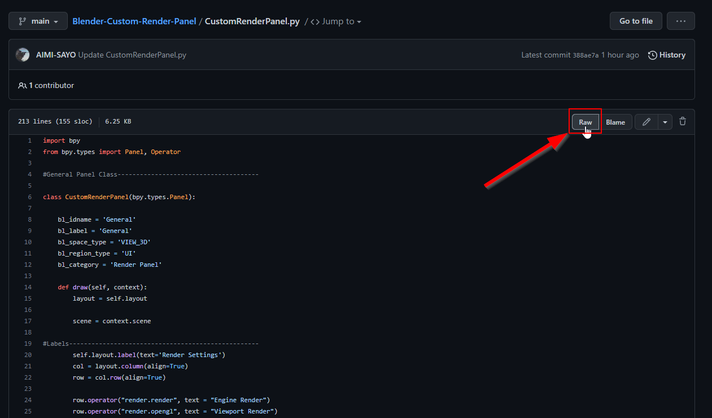
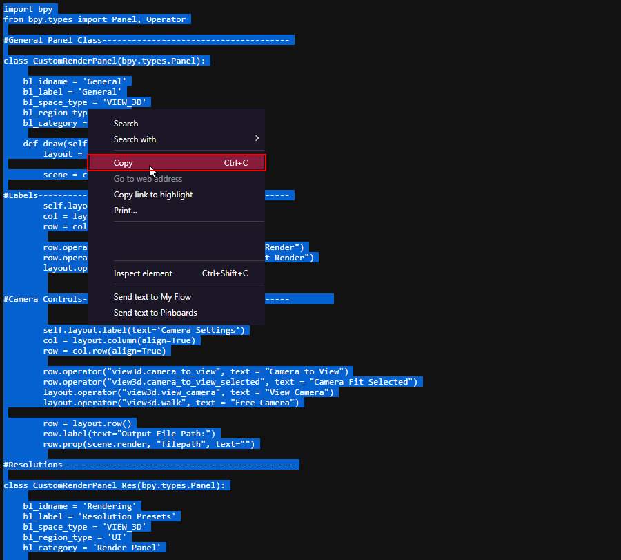
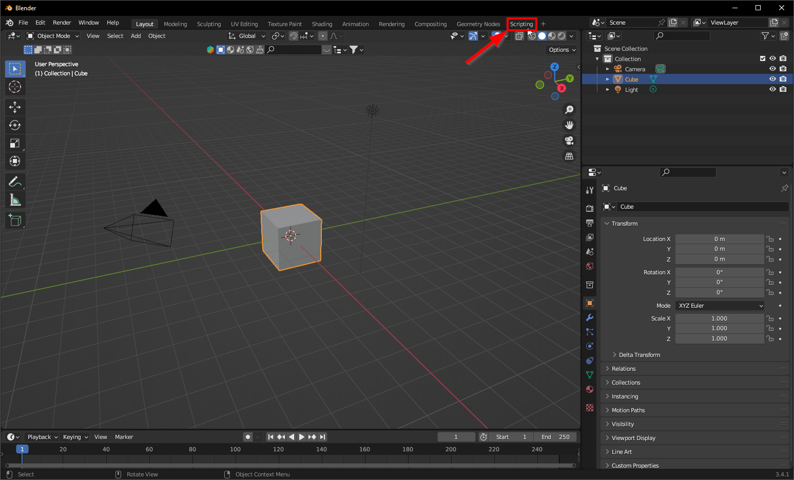
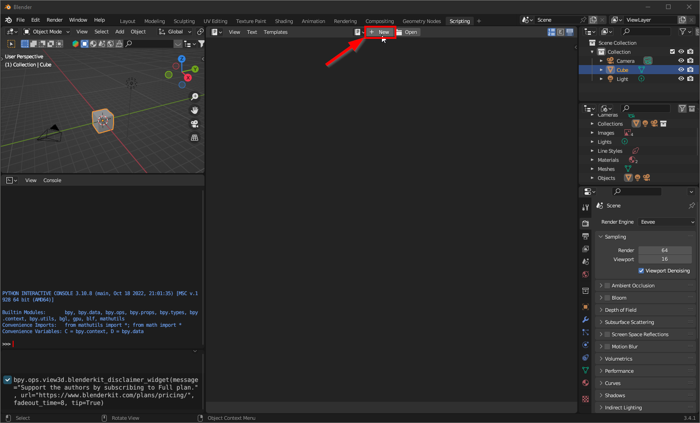
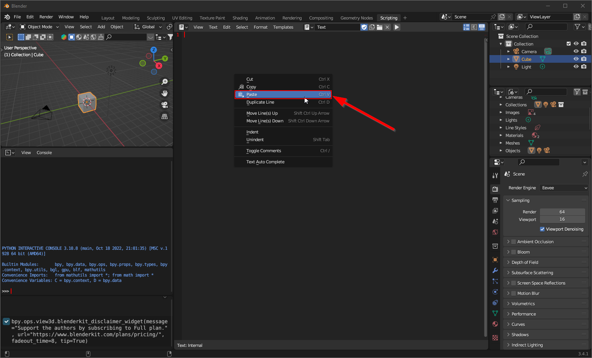
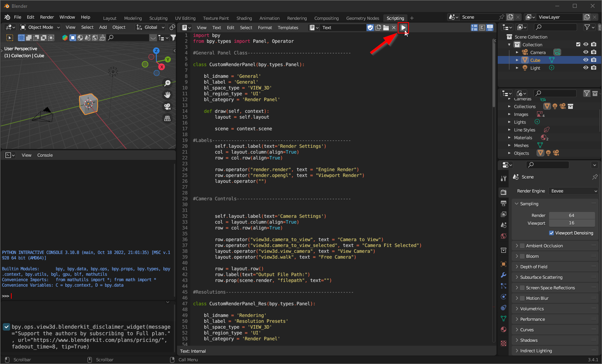
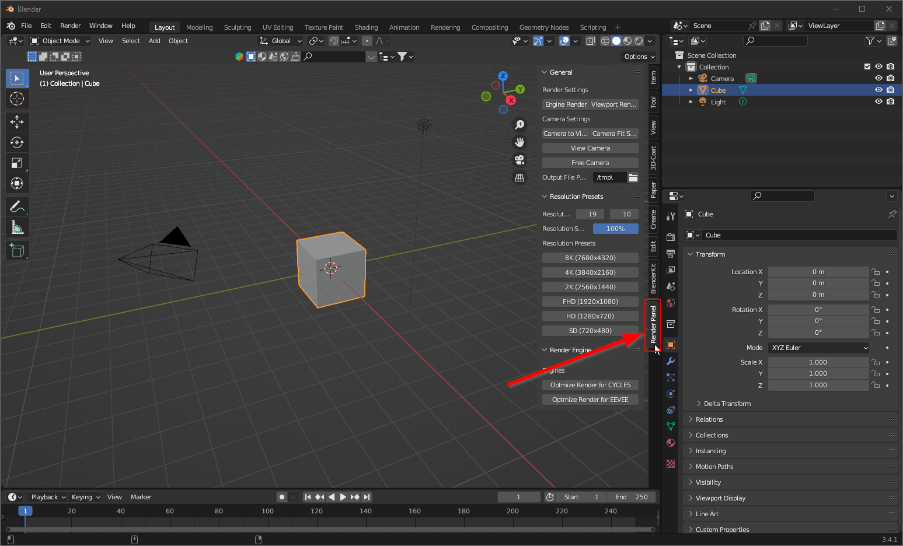

# Blender-Custom-Render-Panel
Custom Panel to make life easier for Beginners and Professional artists

## Installation
- Open a project or create a new one
- Open Scripting tab workspace
- Make a new text
- paste the script and click run

## Step-by-Step Install Instruction

